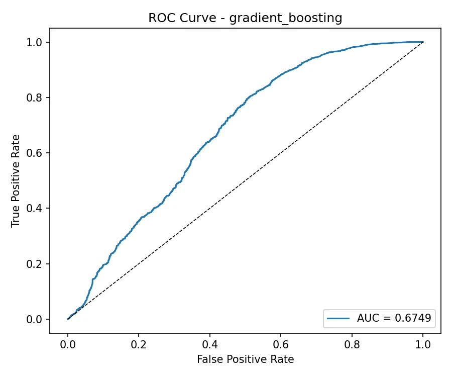
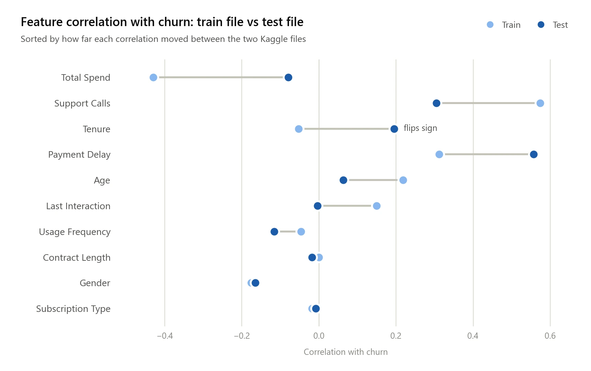
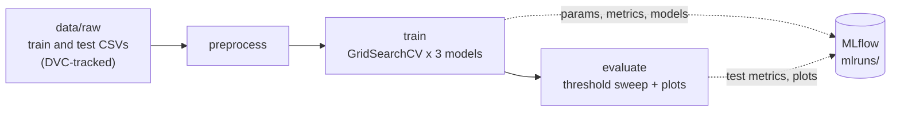

<div align="center">

# Customer Churn Prediction MLOps

A reproducible churn prediction pipeline built with DVC, MLflow, pytest and GitHub Actions,<br>
and a case study in what happens when the test data doesn't look like the training data.

[![Python][badge-python]][link-python]
[![scikit-learn][badge-sklearn]][link-sklearn]
[![imbalanced-learn][badge-imblearn]][link-imblearn]
[![MLflow][badge-mlflow]][link-mlflow]
[![DVC][badge-dvc]][link-dvc]
[![pytest][badge-pytest]][link-pytest]

[![CI][badge-ci]][link-ci]
[![License: MIT][badge-license]](LICENSE)

</div>

## About

The pipeline predicts whether a subscription customer will churn from ten account features: age, gender, tenure, usage frequency, support calls, payment delay, subscription type, contract length, total spend and days since the last interaction. DVC runs it end to end (preprocess, train, evaluate), MLflow records every model, metric and plot, 38 pytest tests cover the preprocessing and modelling code, and GitHub Actions runs those tests on every push.

The dataset comes as two files, a training file and a separate test file. Models scored almost perfectly on a validation split of the training file and then fell apart on the test file. The covariate shift analysis below shows why: several features relate to churn differently in the two files, and one of them flips direction.

## Results

### Validation (20% stratified split of the training file, threshold 0.5)

| Model | ROC-AUC | F1 | Recall | Precision | Accuracy |
|---|---|---|---|---|---|
| Logistic Regression | 0.928 | 0.864 | 0.830 | 0.901 | 0.852 |
| Random Forest | 1.000 | 0.994 | 0.989 | 1.000 | 0.994 |
| Gradient Boosting (selected) | 1.000 | 1.000 | 1.000 | 1.000 | 1.000 |

The training file is almost perfectly separable, so both tree models reach a validation ROC-AUC of 1.000. Gradient boosting has the highest validation recall and is the model that goes on to the test file.

### Test (the separate test file, 64,374 customers)

| Metric | Value |
|---|---|
| ROC-AUC | 0.675 |
| F1 | 0.656 |
| Recall | 0.999 |
| Precision | 0.488 |
| Accuracy | 0.503 |

On the test file the model predicts churn for almost everyone. It catches 99.9% of churners, but it also flags 94% of the customers who stayed, which leaves accuracy at roughly a coin flip. Recall stays near 1.0 even with a decision threshold of 0.8, so nearly every predicted probability is above 0.8 and moving the threshold between 0.2 and 0.8 changes almost nothing.

<p align="center">
  
</p>

## Why the test score collapses

<picture>
  <source media="(prefers-color-scheme: dark)" srcset="docs/images/churn-drift-dark.webp">
  
</picture>

`data/processed/reports/covariate_shift_analysis.md` compares each feature's correlation with churn in the two files:

| Feature | Train | Test | Change |
|---|---|---|---|
| Total Spend | -0.4294 | -0.0789 | 0.3505 |
| Support Calls | 0.5743 | 0.3046 | 0.2696 |
| Tenure | -0.0519 | 0.1953 | 0.2472 |
| Payment Delay | 0.3121 | 0.5574 | 0.2453 |
| Age | 0.2184 | 0.0635 | 0.1549 |
| Last Interaction | 0.1496 | -0.0028 | 0.1524 |

The other four features (usage frequency, contract length, gender and subscription type) move by less than 0.07.

The training file teaches the model that high spenders rarely churn and that customers who call support a lot usually do. In the test file both signals are much weaker, tenure goes from slightly protective to a churn signal, and payment delay matters far more. The churn rate also drops from 56.7% to 47.4%. A model that fits the training file perfectly has learned rules that the test file does not follow, which is the same failure a deployed model hits when customer behaviour shifts after training.

## How it works



| Stage | What it does | Main outputs |
|---|---|---|
| `preprocess` | Drops `CustomerID` and the null rows, label-encodes gender, subscription type and contract length, scales numeric features, splits the training file 80/20 (stratified), and applies SMOTE to the training split only | NumPy arrays for train, validation and test, the fitted encoders and scaler |
| `train` | Runs a 5-fold `GridSearchCV` scored on ROC-AUC for each model, logs each best estimator and its validation metrics to MLflow, and picks the model with the highest validation recall | One `.pkl` per model and the selected model's name, path and run ID |
| `evaluate` | Sweeps thresholds from 0.20 to 0.79 to maximise F1 while keeping precision at or above 0.50 (falling back to 0.5 if none qualify), then logs test metrics and plots to the selected model's MLflow run | Confusion matrix, ROC curve, threshold sweep, classification report, `evaluation_summary.json` |

Every tunable value, including the hyperparameter grids, the SMOTE settings and the threshold search, lives in `params.yaml`, and DVC reruns a stage only when its code, data or parameters change. Logistic regression and random forest also use `class_weight="balanced"` as a second guard against class imbalance.

The encoders and the scaler are fitted on the training data and reused for the test file, so nothing about the test set leaks into preprocessing.

## Getting started

### Setup

```bash
git clone https://github.com/RudraSomaiya/Church-Prediction-MLops.git
cd Church-Prediction-MLops
uv venv .venv --python 3.11
source .venv/bin/activate        # Windows: .venv\Scripts\Activate.ps1
uv pip install -r requirements.txt
```

### Data

Download the [Customer Churn Dataset](https://www.kaggle.com/datasets/muhammadshahidazeem/customer-churn-dataset) from Kaggle and put `customer_churn_train.csv` and `customer_churn_test.csv` in `data/raw/`. The repository stores only DVC pointer files for them. The DVC remote in `.dvc/config` is a local folder, so `dvc pull` only works on the machine that holds it; point the remote at shared storage if you want to pull the data elsewhere.

### Run the pipeline

```bash
dvc repro            # runs preprocess, train and evaluate in order
dvc repro --force    # rerun every stage even if nothing changed
mlflow ui            # browse runs at http://localhost:5000
```

### Tests

```bash
pytest tests/ -v
pytest tests/ -v --cov=src --cov-report=term-missing
```

The tests build small synthetic datasets, so they need neither the real data nor a pipeline run. `test_data_processing.py` covers null handling, encoding, scaling and SMOTE; `test_model.py` covers model construction, metric ranges, fitting and the threshold search, including the fallback when no threshold meets the precision floor.

## Continuous integration

`.github/workflows/ci.yml` runs on pushes and pull requests to `main`. It sets up Python 3.11, installs the requirements with uv and runs the test suite. CI does not pull DVC data because the tests don't need it.

## Project layout

```
.
├── dvc.yaml / dvc.lock          Pipeline stages and locked outputs
├── params.yaml                  Every tunable parameter
├── src/
│   ├── data/
│   │   ├── download_data.py     Checks that the raw files exist and look sane
│   │   └── preprocess.py        Cleaning, encoding, scaling, split and SMOTE
│   └── models/
│       ├── train.py             Grid search, MLflow logging and model selection
│       └── evaluate.py          Threshold sweep, plots and test metrics
├── tests/                       38 pytest tests on synthetic data
├── data/
│   ├── raw/                     DVC pointers to the Kaggle CSVs
│   └── processed/reports/       Covariate shift analysis
├── docs/images/                 Figures used in this README
└── .github/workflows/ci.yml     Test workflow
```

## Limitations

- The threshold sweep runs on the test file, so a tuned threshold would be fitted to the data it is scored on. It should use the validation split. In this run no threshold reached the precision floor, so the default 0.5 was kept and the reported test numbers are not affected.
- Grid search optimises ROC-AUC, but the final model is picked by validation recall. With validation scores this close to 1.0, neither criterion separates the tree models in a meaningful way.
- The MLflow metric called `cv_best_recall` actually stores the best cross-validated ROC-AUC; the name dates from when the grid search scored recall.
- Label encoding gives nominal features such as gender an arbitrary order. Tree models don't mind, but logistic regression treats the codes as numbers.
- The covariate shift report is a one-off analysis. Nothing in the pipeline checks new data for drift before scoring it.

## License

Released under the [MIT License](LICENSE). The dataset belongs to its Kaggle author and is not included in this repository.

## Author

Made by Rudra Somaiya.

[![GitHub][badge-github]][link-github]
[![LinkedIn][badge-linkedin]][link-linkedin]

[badge-python]: https://img.shields.io/badge/Python-3.11-3776AB?style=for-the-badge&logo=python&logoColor=white
[badge-sklearn]: https://img.shields.io/badge/scikit--learn-F7931E?style=for-the-badge&logo=scikitlearn&logoColor=white
[badge-imblearn]: https://img.shields.io/badge/imbalanced--learn-SMOTE-2C5BB4?style=for-the-badge
[badge-mlflow]: https://img.shields.io/badge/MLflow-0194E2?style=for-the-badge&logo=mlflow&logoColor=white
[badge-dvc]: https://img.shields.io/badge/DVC-13ADC7?style=for-the-badge&logo=dvc&logoColor=white
[badge-pytest]: https://img.shields.io/badge/pytest-0A9EDC?style=for-the-badge&logo=pytest&logoColor=white
[badge-ci]: https://github.com/RudraSomaiya/Church-Prediction-MLops/actions/workflows/ci.yml/badge.svg
[badge-license]: https://img.shields.io/badge/License-MIT-F7DF1E?style=for-the-badge
[badge-github]: https://img.shields.io/badge/GitHub-RudraSomaiya-181717?style=for-the-badge&logo=github&logoColor=white
[badge-linkedin]: https://img.shields.io/badge/LinkedIn-Rudra_Somaiya-0A66C2?style=for-the-badge&logo=data:image/svg%2bxml;base64,PHN2ZyB4bWxucz0iaHR0cDovL3d3dy53My5vcmcvMjAwMC9zdmciIHZpZXdCb3g9IjAgMCAyNCAyNCI+PHBhdGggZmlsbD0iI2ZmZiIgZD0iTTIwLjQ1IDIwLjQ1aC0zLjU2di01LjU3YzAtMS4zMy0uMDItMy4wNC0xLjg1LTMuMDQtMS44NSAwLTIuMTQgMS40NS0yLjE0IDIuOTR2NS42N0g5LjM1VjloMy40MXYxLjU2aC4wNWMuNDgtLjkgMS42NC0xLjg1IDMuMzctMS44NSAzLjYgMCA0LjI3IDIuMzcgNC4yNyA1LjQ2djYuMjh6TTUuMzQgNy40M2EyLjA2IDIuMDYgMCAxIDEgMC00LjEyIDIuMDYgMi4wNiAwIDAgMSAwIDQuMTJ6TTcuMTIgMjAuNDVIMy41NlY5aDMuNTZ2MTEuNDV6TTIyLjIyIDBIMS43N0MuNzkgMCAwIC43NyAwIDEuNzN2MjAuNTRDMCAyMy4yMy43OSAyNCAxLjc3IDI0aDIwLjQ1Yy45OCAwIDEuNzgtLjc3IDEuNzgtMS43M1YxLjczQzI0IC43NyAyMy4yIDAgMjIuMjIgMHoiLz48L3N2Zz4=
[link-python]: https://www.python.org
[link-sklearn]: https://scikit-learn.org
[link-imblearn]: https://imbalanced-learn.org
[link-mlflow]: https://mlflow.org
[link-dvc]: https://dvc.org
[link-pytest]: https://pytest.org
[link-ci]: https://github.com/RudraSomaiya/Church-Prediction-MLops/actions/workflows/ci.yml
[link-github]: https://github.com/RudraSomaiya
[link-linkedin]: https://www.linkedin.com/in/rudra-somaiya/
